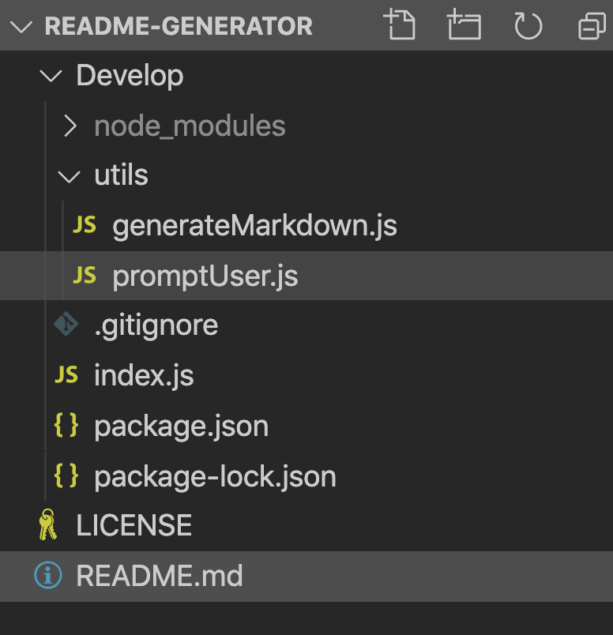

# Readme Generator

A command-line application that dynamically generates a README.md from a user's input. To run the application you will need to:

```
step 1: clone https://github.com/ystamaritq/readme-generator.git
step 2: install node https://nodejs.org/en/download/
step 3: npm install
step 4: node index.js
```

## Developing

Below is a summary of the key files for this project:



- **index.js** main application entry point
- **promptUser** - utilities to get and validate input from user
- **generateMarkdown** - utilities to generate README markdown
- **package.json** - node package definition

## User Stories

```
AS A developer

I WANT a README generator

SO THAT I can easily put together a good README for a new project


```

## Acceptance Criteria

```
GIVEN the developer has a GitHub profile and a repository

WHEN prompted for the developer's GitHub username and repo specific information

THEN a README for the repo is generated


```

## The generated README includes the following sections. And the user can keep all of the sections of some of them.

- At least one Badge (required)
- Title (required)
- Description (required)
- Table of Contents
- Installation
- Usage
- License
- Contributing
- Tests
- Questions
  - User GitHub profile picture
  - User GitHub email

## Demo

#### - The following video demonstrates the application functionality:

[Readme Generator Video _Click Me_](http://www.youtube.com/watch?v=4rH2Fp_MFtM)

## Licensing

"The code in this project is licensed under MIT license."

---

**developed with love by **@ystamaritq\*\*\*\*
